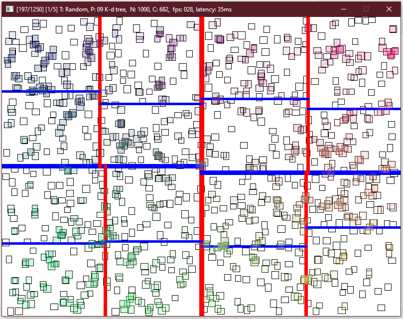

This repository contains implementations of several spatial grouping/broad phase
collision detection algorithms and data structures.

Read my [**blogpost article**](https://magley.github.io/posts/0002_broadphase/) for
insight in the theoretical background of these algorithms as well as a benchmark
analysis.  



Featuring these broad phase algorithms:
- naive
- sort and sweep
- grid hashing
- quad tree
- R-tree (top down)
- R-tree (bottom up with bulk loading):
    - X-Sort
    - Sort-Tile-Recusrive
    - Hilbert-Curve
- K-d tree

The windowing and visualization is powered by SDL3. I've bundled the neccessary
SDL binaries for Windows because dependency management in Windows is _still_
unpleasant. Benchmark plotting is done in Python using matplotlib. 

## Getting started

The project is written in D and you can bulid and run it using `dub`: 

```sh
dub build
dub run
```

You can run the benchmark in headless mode by passing the `--headless` flag.
Otherwise, the program will use SDL to spawn a window and render the collision
world for each test. Note that non-headless mode carries a performance penalty. 

To plot the results after running the benchmark, you will need matplotlib"

```sh
python ./benchmark/analyze.py
```

## Code structure

The code structure is as follows:

- `src/`
    - `app.d` is the program entry point 
    - `vector.d` and `rect.d` are 2D vector and axis-aligned rectangle data types
    - `entity.d` creates an abstraction for entities processed in the program
    - `input.d` is a wrapper for SDL's keyboard input mechanisms
    - `collision.d` is a controller for determining which strategy to use
    - `vendor/` are my custom SDL bindings in D, vendored directly in the program
    - `impl/` contains the implementation of each broad phase mechanism in its own file
    - `benchmark/` package defines program state for benchmarking
    
Each of the implementations is a class implementing an interface for fetching
all collisions based on its current state. Each of these also expects a
reference to context objects like the list of entities and the SDL renderer
handle.<BR/>
Normally this is done through global variables, but the focus of this project are the algorithm implementations, so as long as your entities are stored as contiguous arrays (directly or through pointers) and those entities have a position and shape in the game world, these implementations can also work.<BR/>
Therefore, I have unintentionally kept the academic tradition of the
non-essential code being written only to be compiled by a machine, not to be read
by a human.

If you wish to alter the test cases, start wtih `benchmark/runner.d` and adjust
`benchmark/placement.d` accordingly if needed. Please note that some strategies
like _brute force_ and _top down r-tree_ perform poorly as the number of
entities and true positive collisions rises. The entry point to the benchmark is
in `benchmark/package.d`. You can change the output file path there.

## License

Licensed under the BSD 2-Clause license. See [LICENSE](./LICENSE) for more info.